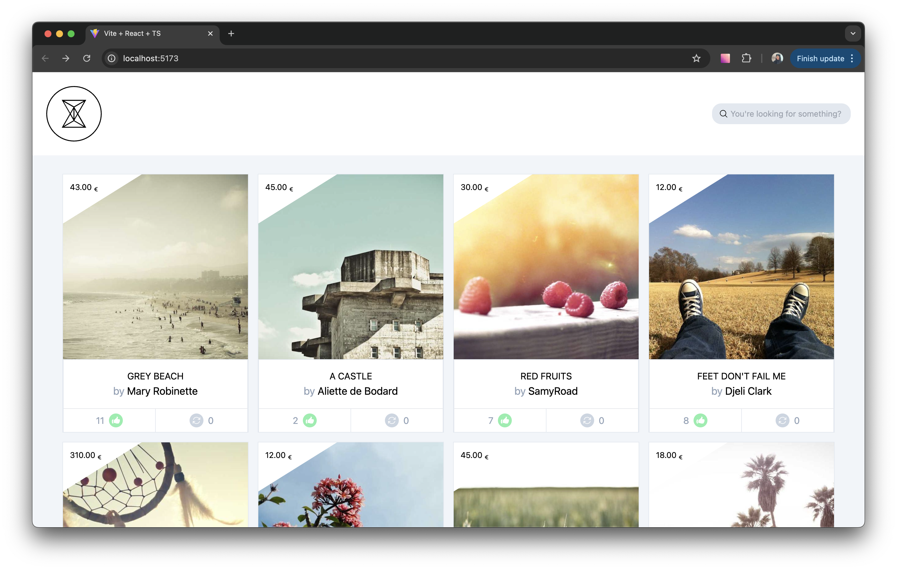
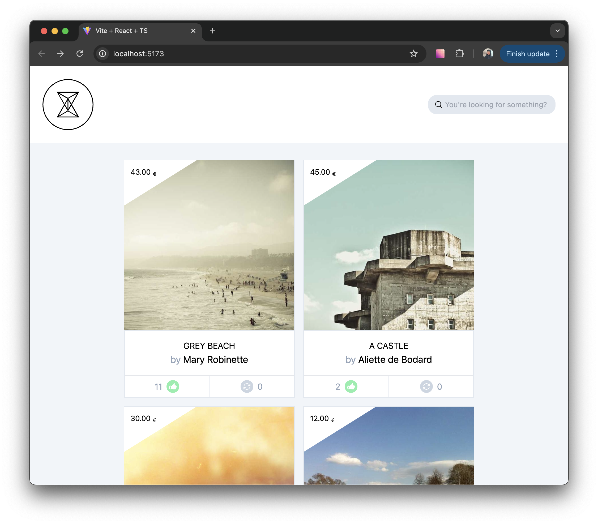
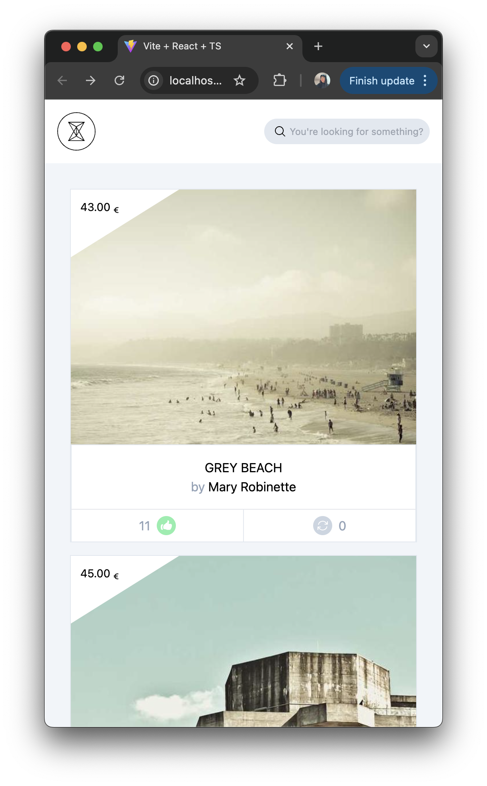

# Image Gallery Application





## Technical decisions 🤔

- For making calls to the API I decided to use axios because I'm familiar whit it and to keep things simple due to the time constraints of the technical chalenge. However, in the case of a real application it wold be useful to have a library that can handle the UI state management based on network operations. In this case I had to implement the loading state manually using React Hooks and at the end I had to write a lot of code inside of useEffects and ignore ESlint warnings that could have been avoided with a proper handling.

- For the frontend application setup I decided not to use NextJS, I figured it was an overkill for a project this size. Instead, I decided to use Vite because the setup is quick and because the project is frontend-focused.

- I also decided to use TypeScript because i like the type safety it provides beside the other features.

- I considered using Material UI since it provides a lot of components ready to be used in production, however I ended up using Tailwind CSS because I wanted to give it a try, because it is higly customizable and to showcase my css skills. 🤓

- I chose Jest for testing since I'm familiar with it, however I found out that I could have used Vitest and the setup would have been simpler.

- For the Infinite scroll feature, since the pagination is not implemented in the backend the list of images is repeating which I consider is ok for the purposes of this test.

- For the text search feature I decided to use a library called debounce, because the commonly-used lodash would have been an overkill in terms of weight. Another option I considered was to implement my own function but the types are a little bit complex and would have required more time to implement properly.

## Project Structure 🌳

```plaintext
front-test-master/
├── client/
│   ├── src/
│   │   ├── components/
│   │   │   ├── Header
│   │   │   ├── ImageCard
│   │   │   ├── ImageList
│   │   │   ├── Logo
│   │   │   ├── PriceTag
│   │   │   └── SearchBar
│   │   ├── services/
│   │   │   └── imageService.ts
│   │   ├── App.tsx
│   │   └── index.tsx
│   ├── public
│   ├── assets
│   └── package.json
├── mocks-server/
│   └── mocks/
│       ├── routes/
│       │   ├── images.js
│       │   └── middlewares.js
│       └── mocks.json
└── README.md
```

## Setup ⚙️

To run the project locally, follow these steps:

- 🐑 Clone the repository

```bash
git clone https://github.com/susird/front-test-master.git
```

- 🧑🏽‍🔧 To install the backend and frontend dependencies run

```bash
pnpm run install-all
```

- 💻 To start the development servers run

```bash
pnpm run start
```

- 👩🏻‍💻 Go to http://localhost:5173/

## Features 🧾

- 🖼 Image Gallery

The main page displays a gallery of images fetched from the mock server. Users can scroll through the images, and as they reach the end of the list, more images are loaded automatically. Users can also like the images.

- 🔍 Search Functionality

A search bar is included to allow users to filter images based on the title and the author of the image.

- 📱 Responsive Design

The application is fully responsive, ensuring usability across various devices.

## Wall of shame: Things I didn't have to implement or I would like to improve 🫣

- Better thinking about the architecture to avoid the use of so many useEffects.
- Image responsiveness using srcset attribute to display the apropiate images depending on the screensize and resolutions.
- Implementation of the infinite scrolling using the Intersection Observer API.
- More exhaustive tests to increase the coverage.

---

# Requerimientos

Necesitamos desarrollar una Single Page Application (SPA) que muestre la información de nuestras imagenes:

1. Mostrar todas las imagenes con un scroll infinito.
2. Filtrar el contenido a través de una búsqueda (No es necesario que el resultado sea coherente).
3. Realizar un like/unlike de cada uno de los items. UI responsive.

# Información

En el momento del desarrollo de la aplicación cliente, el API no se encuentra desarrollada, por
lo que esta incluida una api mock que simula el comportamiento de la API.

Para arrancar la api mock simplemente ejecutar:

`npm run mocks`

## Endpoints

### `GET http://localhost:3100/images`

```json
[
  {
    "type": "Image",
    "id": 2,
    "title": "Train in India-Agra",
    "author": "SamyRoad",
    "created_at": "2012-12-12T21: 08: 20Z",
    "main_attachment": {
      "big": "http://lorempixel.com/400/500/",
      "small": "http://lorempixel.com/100/125/"
    },
    "likes_count": 5,
    "liked": true,
    "links": [
      {
        "rel": "avatar",
        "uri": "http://lorempixel.com/250/250/",
        "methods": "GET"
      },
      {
        "rel": "like",
        "uri": "http://localhost:3100/images/2/likes",
        "methods": "POST"
      }
    ]
  },
  ...
]
```

Se puede utilizar los query params `search` y `page` para simular la busqueda y paginación.

### `POST http://localhost:3100/images/:id/likes`

Espera un body vacio y respondera con un 204 si todo ha ido correctamente, simula la acción de like.

# Diseño

La visualización de la aplicación cambia dependiendo del dispositivo que se este utilizando.

- En el caso de que se utilice un dispositivo móvil, se debe de mostrar la aplicación siguiendo el diseño mobile.psd.
- En el caso que se utilice una pantalla mayor, se debe de utilizar el diseño web.psd, con un mínimo de 2 columnas y un máximo de 4.

Los diseños se pueden encontrar [aqui](https://www.dropbox.com/sh/r1fp5nz7x046kjt/AACQdbp6bZlv2pNtCN2lTEoEa?dl=0).

Si no dispones de photoshop puedes usar [photopea](https://www.photopea.com/).

# Implementación

- Diseñar e implementar la aplicación usando preferiblemente React.
- HTML y estilos responsive a partir de los PSDs: mobile para móviles y web para Desktop.

Se valorarán el uso e implementación de tests.
